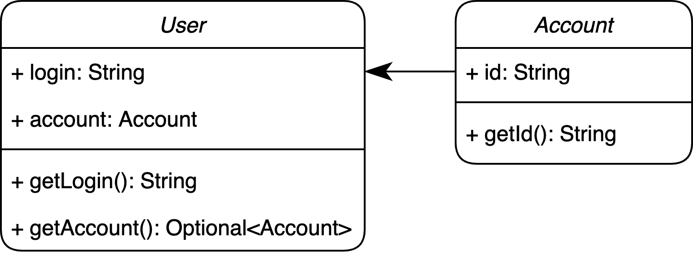

# Finding users by accounts

## Description
Given the following classes:

Implement a method `findUserByAccountId(Set<User> users, String id)` that returns `Optional<User>` from a given set of users. If the user with a specified account id exists, the method should return the `Optional<User>` that encapsulates the found user, otherwise it should return the `Optional.empty`. Note that the given `id` is always not `null`.

## Tags
- applying functions to collections and monads
- optionals
