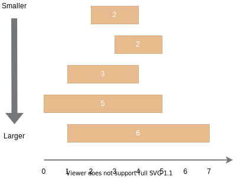

# The tree of ranges

## Description
Java provides a special implementation of the `Set` interface called `TreeSet` that guarantees us the ordering of the elements. It corresponds to the sorting order of the elements determined by either natural order or specific `Comparator` implementation.

You need to create a comparator to use it in a `TreeSet` that stores objects of the custom class `LongRange`. The class contains two fields called `left` and `right` to represent the borders.

The objects will be sorted according to the following rules:

1. If one range is longer than others, then it is the larger in the sorting order.
2. If several ranges have the same length, the smaller is the one with the smaller left border.
3. The sorting goes in the ascending order.



**It is guaranteed** that the left border of ranges is always less than the right one, but their values can be negative as well. There is also a guarantee that the tests won't produce a type overflow, so you don't need to cope with it.

We've provided a template for your solution. You need to implement the `getComparator` method of the `LongRange` class properly. Please, do not delete any members of the class.

Here is an example of using the method. The sorting order in the example corresponds the picture above.

```java
Set<LongRange> numbers = new TreeSet<>(LongRange.getComparator());

numbers.add(new LongRange(0, 5));
numbers.add(new LongRange(2, 4));
numbers.add(new LongRange(1, 4));
numbers.add(new LongRange(1, 7));
numbers.add(new LongRange(3, 5));

numbers.forEach(System.out::println);
```

If your implementation is right, the code will print:

```console
2 4
3 5
1 4
0 5
1 7
```

## Examples
**Sample Input 1:**
```console
0 5
2 4
1 4
1 7
3 5
```

**Sample Output 1:**
```console
2 4
3 5
1 4
0 5
1 7
```

**Sample Input 2:**
```console
0 10
-10 0
0 5
-4 1
```

**Sample Output 2:**
```console
-4 1
0 5
-10 0
0 10
```

## Tags
- sorting data with functional comparators
- treeSet