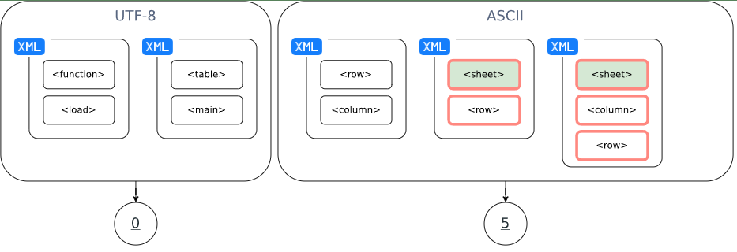

# XML tags [HARD]

## Description
There is a class that represents an XML file:

```java
class XmlFile {
    private final String id;
    private final String encoding;
    private final List<Tag> tags;

    // constructor and getters
}
```

And the corresponding `Tag` class that represents the XML tag:

```java
class Tag {
    private final String name; 

    // constructor and getters
}
```

Implement the `XmlUtils.countAllByTagName` method that accepts a list of XML files and a tag name and produces a map whose keys are the XML file encoding, and the corresponding values are the **total numbers of tags in the files that contain the specified tag**. If the XML file tags do not contain the specified tag name, the value should be equal to 0.

Let's consider an example where the following XML files are given:

```java
List<XmlFile> xmlFiles = List.of(
    new XmlFile("1", "UTF-8", List.of(new Tag("function"), new Tag("load"))),
    new XmlFile("2", "UTF-8", List.of(new Tag("table"), new Tag("main"))),
    new XmlFile("3", "ASCII", List.of(new Tag("row"), new Tag("column"))),
    new XmlFile("4", "ASCII", List.of(new Tag("sheet"), new Tag("row"))),
    new XmlFile("5", "ASCII", List.of(new Tag("sheet"), new Tag("column"), new Tag("row")))
);

XmlUtils.countAllByTagName(xmlFiles, "sheet"); // returns ​{"UTF-8"=0, "ASCII"=5}
```

The `countAllByTagName` method should return 0 for the UTF-8 encoded files because there are no `sheet` tags among UTF-8 encoded files, and 5 for the ASCII encoded files because there are 5 tags in total in 2 ASCII encoded files that contain the `sheet` tag.



## Tags
- deep dive into streams
- grouping elements using collectors